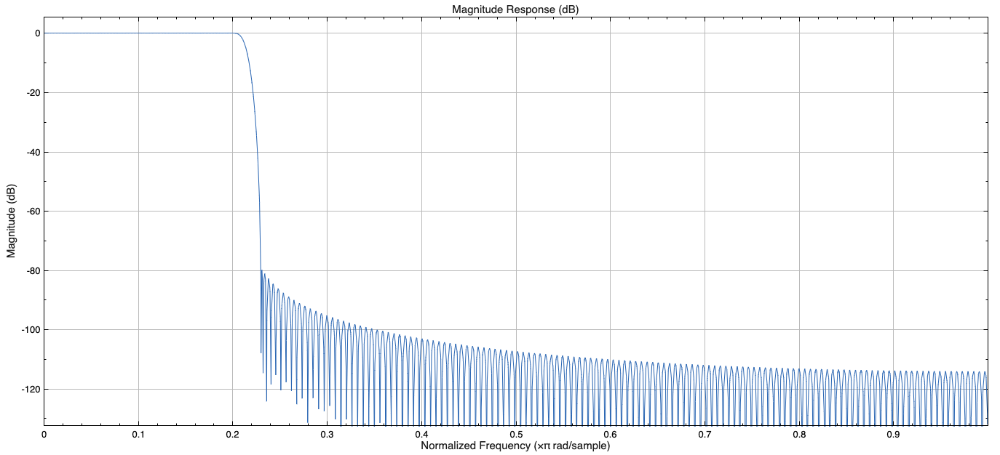
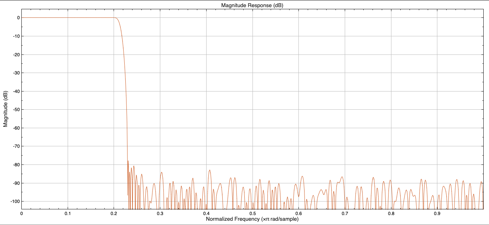

# Course Project: FIR Filter Design and Implementation

## FIR filter design

The requirements of the filter as given by the project requirements were as
follows:

- low pass filter
- $0.2\pi ~ 0.23\pi \text{ rad/sample}$
- Stopband attenuation of at least 80dB
- 100+ taps

### Matlab design

The first step is the find the number of taps required to have a filter with
these specifications. We can use the Kaiser window method to find the filter
order with the kaiserord function from matlab.

``` matlab
fpass = 0.2;
fstop = 0.23;
fcuts = [fpass fstop];
mags = [1 0];
devpass = 0.01;
devstop = 10^(-80/20);
devs = [devpass devstop];

[n,Wn,beta,ftype] = kaiserord(fcuts,mags,devs);
```

From this we find we need a filter order of 355, a Wn of 0.215, and a beta of
7.8573.

We can now build this filter with the fir1 function and visualize it with the fvtool

``` matlab
h = fir1(n, Wn, kaiser(n+1, beta));
filterAnalyzer(h)
```

#### Quantization

The next step is to add quantization to the filter in order to create a more
cost effective filter.

``` matlab
h_q = fi(h, 1, 19, 18); % quantized coefficients
filterAnalyzer(double(h_q));
```

We can do this in matlab by converting the coefficients into fixed point at a
certain length. In this case 19 bits is the maximum we can do while still
achieving the specified attenuation.

### Structure of Verilog

#### Function Setup

``` verilog
module basicfir 
#(
    parameter TAPS = 336,
    parameter DATA_WIDTH = 16,
    parameter COEFF_WIDTH = 19,
    parameter INTER_WIDTH = 35
) 
(
    input                          clk, en,
    input signed [TAP_WIDTH-1:0]   taps [TAPS-1:0],
    input signed [DATA_WIDTH-1:0]  input_data,
    output signed [DATA_WIDTH-1:0] output_data
);
 
reg signed [DATA_WIDTH-1:0] buffers [TAPS-1:0];
reg signed [INTER_WIDTH-1:0] acc;
integer                      i;
```

We first define our parameters we brought from our filter design in matlab,
which we can also use to define our registers we will be using.

#### Buffer

``` verilog
always @(posedge clk)
  if (en == 1'b1)
    begin
       for (i = 1; i < TAPS; i = i + 1) begin
          buffers[i] <= buffers[i-1];
       end
       buffers[0] <= input_data;
    end
```

We can create a chain of buffers, one per stage, to delay the elements required
for the next section of the fir filter.

#### Multiply-Accumulation Stage

``` verilog
always @(posedge clk)
  if (en == 1'b1)
    begin
       acc = 0;
       for (i = 0; i <= TAPS; i = i + 1) begin
          acc = acc + buff[i] * taps[i];
       end
       output_data <= acc >>>> 16;
    end
```

These delayed buffers are then each processed through their taps and summed
together to achieve the output of the fir filter.

## Filter Frequency Response

### Original



### Quantized



### Quantization Comments

The effect of quantizing the coefficients decreased the size requirements
greatly; however, the quantization could only be done to a certain length before
the filter no longer kept the required 80dB of stopband attenuation.
In order to prevent overflow the intermediate data has double the size so
multiplying the taps and input will not extend past the size. While this method
works there are other methods if a smaller size is prioritized over a simpler implementation.

## Architecture of pipelined and parallelized FIR Filter

### Pipelined

The pipelined filter moves the buffer elements from the top to the bottom in order to
seperate out the multiplier and adders into stages with a single multiplier and
a single adder shortening the critical path for each clock cycle.

``` verilog
reg signed [INTER_WIDTH-1:0] buffers [TAPS-1:0];
integer                      i;

// multiply-accumulation stage
always @(posedge clk)
  if (en == 1'b1)
    begin
       for (i = 0; i < TAPS-1; i = i + 1) begin
          buffers[i] <= buffers[i+1] + input_data * taps[i];
       end
       buffers[TAPS-1] <= input_data * taps[TAPS-1]
       output_data <= buffers[0] >>> 19;
    end
```

This also simplifies the implimentation. The buffers however now need to be the
intermediade width instead of the data width which will increase their size and
the size of the entire implementation.

### Combined

From the pipelined filter, we can parralelize it to increase the throughput by
using splitting the stream into even and odd components. These components can
then be used to create two seperate paths with half the buffers each.

``` verilog
always @(posedge clk)
  if (en == 1'b1)
    begin
       if (toggle == 1'b0)
         begin
            toggle = 1'b1;
            input_even <= input_data;
            output_data <= output_even;
            val = 0
         end
       else
         begin
            toggle = 1'b0;
            input_odd <= input_data;
            output_data <= output_odd;
            val = 1'b1;
         end
    end
```

Here we can see the process for seperating the paths and merging them back together.

``` verilog
always @(posedge clk)
  if (en == 1'b1 & val == 1'b1)
    begin
       // path 1
       for (i = 0; i < TAPS-2; i = i + 2) begin
          buffers[i] <= buffers[i+2] + input_even * taps[i] + input_odd * taps[i+1];
       end
       buffers[TAPS-1] <= input_data * taps[TAPS-1];
       output_data <= buffers[0] >>> 19;

       // path 2
       for (i = 1; i < TAPS-2; i = i + 2) begin
          buffers[i] <= buffers[i+2] + input_odd * taps[i] + input_even * taps[i+1];
       end
       buffers[TAPS-1] <= input_data * taps[TAPS-1];
       output_even <= buffers[1] >>> 19;
    end 
```

Here we can see the two paths in the accumulation and multliplication which
yield.

### Comparison

Pipelining the fir filter was able to decrease the critical path, increasing the
allowable clock speed, while
the parallelization allows higher throughput with the same clock speed.

## Hardware Implementation Results

| Filter | Area | Clock Frequency | Power Estimation |
| --- | --- | --- | --- |
| Basic | | | |
| Pipelined | | | |
| Combined | | | |

## Further Analysis and Conclusion
